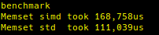
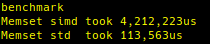
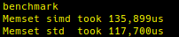

# simd
## <ins>learn to prog using gcc simd compiler intrinsics<ins>  
CPU: Core i7-6 model 94 supporting AVX2 and sse4.2

First round of test are not as expected. Aligned alloc showed no difference (though it is possible that the alloc that was not specifically aligned was in fact aligned)  
This test was with the _mm256_storeu_si256 intrinsic  

  
memset uses larger types, such as int64_t to write  

  
Notice that building with optimization disabled affects the simd runtime way more than memset  

I will need to profile the code and look for cache hits vs misses. Expecting cache misses as I am invalidating the cache by writing a diff value for each iteration writing to memory.  
Interesting: running with one iteration, the simd call always  does better.  Is it the cache??  

  
Looking at the asm generated,  I saw something that should have been obvious. _mm256_set1_epi8 does not need to be in the loop and that it generates a lot of instructions  
Being out of the loop, optimizing the size of the type until the runtimes are significanty better.  
