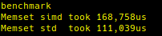
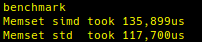

  
[(back)](../README.md)
  
**Can vector (simd) instructions outperform memset writes using standard instruction set**     
Using AVX2 simd intrinsics, I will compare the performance of glic memset against _mm256_set1_epi8 vector instruction  
  
The _mm256_set1_epi8 can write 32byes (256 bits) at a time  
  

## <ins>goal: learn to prog using gcc simd compiler intrinsics<ins>  
CPU: Core i7-6 model 94 supporting AVX2 and sse4.2

## Note: Added a command line options header only library  
I did not want to install so I made a sym link to the library as  
ln -s <path>/cxxopts/include include  
just point your make file INCLUDEDIR to the symlink to path aboove  
  
First round of test are not as expected. Aligned alloc showed no difference (though it is possible that the alloc that was not specifically aligned was in fact aligned)  
This test was with the _mm256_storeu_si256 intrinsic  

  
memset uses larger types, such as int64_t to write  

  
Notice that building with optimization disabled affects the simd runtime way more than memset  

I will need to profile the code and look for cache hits vs misses. Expecting cache misses as I am invalidating the cache by writing a diff value for each iteration writing to memory.  
Interesting: running with one iteration, the simd call always  does better.  Is it the cache??  

  
Looking at the asm generated,  I saw something that should have been obvious. _mm256_set1_epi8 does not need to be in the loop and that it generates a lot of instructions  
Being out of the loop, optimizing the size of the type until the runtimes are significanty better.  
  
  
  
  
Here is the asm where memset is called, not so interesting  
Will need to hunt down the actual code  
  
  
Here is the asm for the SIMD intrinsic  
  
The code is looking better now, and the simd is pperforming nicely  
   
**perf testing**    
**<ins>benchmark: byes alloc:4096, iterations:50,000,000</ins>**  
writing one page of data and rotating the write to try for cache misses  
release build  
  
```
Usage:  
perf test of memset using simd instructions  vs glibc memset  
Usage:  
  simd [OPTION...]  
  
  -i, --iterations arg         Number of iterations to run (default: 1000)  
  -m, --mem arg                Memory to allocate for test (default: 512)  
  -r, --reverse                Reverse call order to memset an simd  
  -M, --memset-only            Run memeset only  
  -S, --simd-only              Run simd only  
  -A, --skip-alligned-alloc    Do not run aligned mem alloc  
  -a, --skip-unalligned-alloc  Do not run UN-aligned mem alloc  
  -h, --help                   Usage  
```
  
   
**memset**   
  
<ins>run un-aligned</ins>  
Memset std  took 2,181,315us  
Memset std  took 2,265,742us  
Memset std  took 2,191,280us  
Memset std  took 2,207,894us  
Memset std  took 2,245,681us  
  ave: 2,218,382us  
  
<ins>run aligned</ins>  
Memset std  took 2,204,133us  
Memset std  took 2,303,328us  
Memset std  took 2,188,542us  
Memset std  took 2,197,137us  
Memset std  took 2,208,045us  
  ave: 2,220,237us  
  
**simd memset**  
  
<ins>run un-aligned</ins>  
Memset simd took 1,913,739us  
Memset simd took 1,829,741us  
Memset simd took 1,901,355us  
Memset simd took 1,835,607us  
Memset simd took 1,844,677us  
  ave: 1,865,023us  

<ins>run aligned</ins>  
Memset simd took 1,868,667us  
Memset simd took 1,800,263us  
Memset simd took 1,870,218us  
Memset simd took 1,869,439us  
Memset simd took 1,893,939us  
  ave: 1,860,505us  

**The simd instructuction for memset is 16% faster than memset for wrtitng to a page of memory**  
  

**perf**    
sudo perf stat -Bd ./simd -i 50000000 -m 4096 -M -a  
  
    
  
sudo perf stat -Bd ./simd -i 50000000 -m 4096 -S -a  
    

A quick observations shows that the simd runs had about 5% more cache misses and slightly less branch misses  
and it ran about 16x more instructions than memset.  I will need to look into these numbers to make sure they are being interpreted correctly  
  
Will test with varius write sizes, memset may be better in some circumstances  
